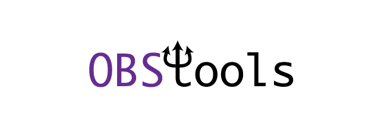

## Software for processing broadband ocean-bottom seismic data

OBStools is a package containing Python tools for processing broadband
ocean-bottom seismic (OBS) data. Current functionalities include removing
vertical component noise from tilt and compliance effects, and calculating
seafloor compliance. The code uses 
the ``StDb`` package for querying and building a station database and
can be used through command-line scripts.

Installation, API documentation, scripts and tutorials are described at https://nfsi-canada.github.io/OBStools/

Authors: [`Pascal Audet`](https://www.uogeophysics.com/authors/admin/) (Developer and Maintainer) & [`Helen Janiszewski`](https://helenjaniszewski.squarespace.com) & (Developer of original Matlab version)

<!-- #### Citing

If you use `OBStools` in your work, please cite the 
[`Zenodo DOI`](https://zenodo.org/badge/latestdoi/211722700).
 -->
#### Contributing

All constructive contributions are welcome, e.g. bug reports, discussions or suggestions for new features. You can either [open an issue on GitHub](https://github.com/nfsi-canada/OBStools/issues) or make a pull request with your proposed changes. Before making a pull request, check if there is a corresponding issue opened and reference it in the pull request. If there isn't one, it is recommended to open one with your rationale for the change. New functionality or significant changes to the code that alter its behavior should come with corresponding tests and documentation. If you are new to contributing, you can open a work-in-progress pull request and have it iteratively reviewed. 

Examples of contributions include notebooks that describe published examples of OBS data
processing. Suggestions for improvements (speed, accuracy, etc.) are also welcome.

#### References

- Bell, S. W., D. W. Forsyth, and Y. Ruan (2014), Removing noise from the vertical component records of ocean-bottom seismometers: Results from year one of the Cascadia Initiative, Bull. Seismol. Soc. Am., 105, 300-313, https://doi.org/10.1785/0120140054

- Crawford, W.C., Webb, S.C., (2000). Identifying and removing tilt noise from low-frequency (0.1 Hz) seafloor vertical seismic data, Bull. seism. Soc. Am., 90, 952-963, https://doi.org/10.1785/0119990121

- Janiszewski, H A, J B Gaherty, G A Abers, H Gao, Z C Eilon, Amphibious surface-wave phase-velocity measurements of the Cascadia subduction zone, Geophysical Journal International, Volume 217, Issue 3, June 2019, Pages 1929-1948, https://doi.org/10.1093/gji/ggz051
