ATaCR
=====

Introduction
************

``atacr`` is a module for the correction of vertical component data from OBS
stations from tilt and compliance noise. This module is a translation of the 
Matlab code `ATaCR  <https://github.com/helenjanisz/ATaCR>`_ and the acronym 
stands for Automatic Tilt and Compliance Removal. For more details on the 
theory and methodology, we refer the interested reader to the following papers:

- Bell, S. W., D. W. Forsyth, and Y. Ruan (2014), Removing noise from the 
  vertical component records of ocean-bottom seismometers: Results from year one of the 
  Cascadia Initiative, Bull. Seismol. Soc. Am., 105, 300-313,
  https://doi.org/10.1785/0120140054

- Crawford, W.C., Webb, S.C., (2000). Identifying and removing tilt noise from 
  low-frequency (0.1 Hz) seafloor vertical seismic data, Bull. seism. Soc. Am., 90, 952-963,
  https://doi.org/10.1785/0119990121

- Janiszewski, H A, J B Gaherty, G A Abers, H Gao, Z C Eilon, Amphibious surface-wave 
  phase-velocity measurements of the Cascadia subduction zone, Geophysical Journal 
  International, Volume 217, Issue 3, June 2019, Pages 1929-1948, https://doi.org/10.1093/gji/ggz051

The analysis can be carried out for either one (or both) compliance or tilt
corrections. In all cases the analysis requires at least vertical component
data. Additional data required depend on the type of analysis. The software 
will automatically calculate all possible corrections depending on the available
channels. 

Noise Corrections
*****************

**Compliance**

Compliance is defined as the spectral ratio between pressure and vertical
displacement data. Compliance noise arises from seafloor deformation due
to seafloor and water wave effects (including infragravity waves). 
This is likely the main source of noise in vertical component OBS data. 
This analysis therefore requires both vertical (``?HZ``) and pressure (``?XH``) data.

**Tilt**

Tilt noise arises from OBS stations that are not perfectly leveled, and
therefore the horizontal seafloor deformation leaks onto the vertical
component. This effect can be removed by calculating the spectral
ratio between horizontal and vertical displacement data. In most cases,
however, the tilt direction (measured on a compass - as opposed to tilt
angle, measured from the vertical axis) is unknown and must be determined
from the coherence between rotated horizontal components and the vertical
component. This analysis therefore requires vertical (``?HZ``) and the two
horizontal (``?H1,2``) component data.

**Compliance + Tilt**

It is of course possible to combine both corrections and apply them
sequentially. In this case the tilt noise is removed first, followed by compliance.
This analysis requires all four components: three-component
seismic (``?HZ,1,2``) and pressure (``?XH``) data.

API documentation
*****************

Base Classes
++++++++++++

:mod:`~obstools.atacr` defines the following base classes:

- :class:`~obstools.atacr.classes.DayNoise`
- :class:`~obstools.atacr.classes.StaNoise`
- :class:`~obstools.atacr.classes.TFNoise`
- :class:`~obstools.atacr.classes.EventStream`

The class :class:`~obstools.atacr.classes.DayNoise` contains attributes
and methods for the analysis of two- to four-component day-long time-series
(3-component seismograms and pressure data). Objects created with this class
are required in any subsequent analysis. The available methods calculate the
power-spectral density (PSD) functions of sub-windows (default is 2-hour windows) 
and identifies windows with anomalous PSD properties. These windows are flagged 
and are excluded from the final averages of all possible PSD and cross-spectral density
functions between all available components.

The class :class:`~obstools.atacr.classes.StaNoise` contains attributes
and methods for the aggregation of averaged daily spectra into a station
average. An object created with this class requires that at least two
`DayNoise` objects are available in memory. Methods available for this class are
similar to those defined in the `DayNoise` class, but are applied to daily 
spectral averages, as opposed to sub-daily averages. The result is a spectral
average that represents all available data for the specific station.  

The class :class:`~obstools.atacr.classes.TFNoise` contains attributes
and methods for the calculation of transfer functions from noise
traces used to correct the vertical component. A `TFNoise` object works with 
either one of `DayNoise` and `StaNoise` objects to calculate all possible
transfer functions across all available components. These transfer functions
are saved as attributes of the object in a Dictionary. 

The class :class:`~obstools.atacr.classes.EventStream` contains attributes
and methods for the application of the transfer functions to the
event traces for the correction (cleaning) of vertical component
seismograms. An `EventStream` object is initialized with raw (or pre-processed)
seismic and/or pressure data and needs to be processed using the same (sub) window 
properties as the `DayNoise` objects. This ensures that the component corrections
are safely applied to produce corrected (cleaned) vertical components. 

:mod:`~obstools.atacr` further defines the following container classes:

- :class:`~obstools.atacr.classes.Power`
- :class:`~obstools.atacr.classes.Cross`
- :class:`~obstools.atacr.classes.Rotation`

These classes are used as containers for individual traces/objects
that are used as attributes of the base classes. 

.. note::

    In the examples below, the SAC data were obtained and pre-processed
    using the accompanying scripts ``atacr_download_data.py`` and 
    ``atacr_download_event.py``. See the script and tutorial for details.

DayNoise
--------

.. autoclass:: obstools.atacr.classes.DayNoise
   :members:

StaNoise
--------

.. autoclass:: obstools.atacr.classes.StaNoise
   :members:

TFNoise
-------

.. autoclass:: obstools.atacr.classes.TFNoise
   :members:

EventStream
-----------

.. autoclass:: obstools.atacr.classes.EventStream
   :members:

Container Classes
+++++++++++++++++

Power
-----

.. autoclass:: obstools.atacr.classes.Power
   :members:

Cross
-----

.. autoclass:: obstools.atacr.classes.Cross
   :members:

Rotation
--------

.. autoclass:: obstools.atacr.classes.Rotation
   :members:

Utility functions
+++++++++++++++++

.. automodule:: obstools.atacr.utils
   :members:

Plotting functions
++++++++++++++++++

.. automodule:: obstools.atacr.plot
   :members:

Scripts
*******

There are several Python scripts that accompany ``~obstools.atacr``. These can be used
in bash scripts to automate data processing. These include scripts to download noise and
event data, and perform tilt and compliance noise removal using either the default
program values or by refining parameters. All of them use a station database provided as a
``StDb`` dictionary. These scripts are:

- atacr_download_data.py

- atacr_download_event.py

- atacr_daily_spectra.py

- atacr_clean_spectra.py

- atacr_transfer_functions.py

- atacr_correct_event.py

``atacr_download_data.py``
++++++++++++++++++++++++++

Description
-----------

Downloads up to four-component (H1, H2, Z and P), day-long seismograms 
to use in noise corrections of vertical
component data. Station selection is specified by a network and 
station code. The database is provided as a ``StDb`` dictionary.

Usage
-----

.. code-block::

    $ atacr_download_data.py -h
    Usage: atacr_download_data.py [options] <station database>

    Script used to download and pre-process up to four-component (H1, H2, Z and
    P), day-long seismograms to use in noise corrections of vertical component of
    OBS data. Data are requested from the internet using the client services
    framework for a given date range. The stations are processed one by one and
    the data are stored to disk.

    Options:
      -h, --help            show this help message and exit
      --keys=STKEYS         Specify a comma-separated list of station keys for
                            which to perform the analysis. These must be contained
                            within the station database. Partial keys will be used
                            to match against those in the dictionary. For
                            instance, providing IU will match with all stations in
                            the IU network. [Default processes all stations in the
                            database]
      -C CHANNELS, --channels=CHANNELS
                            Specify a comma-separated list of channels for which
                            to perform the transfer function analysis. Possible
                            options are H (for horizontal channels) or P (for
                            pressure channel). Specifying H allows for tilt
                            correction. Specifying P allows for compliance
                            correction. [Default looks for both horizontal and
                            pressure and allows for both tilt AND compliance
                            corrections]
      -O, --overwrite       Force the overwriting of pre-existing data. [Default
                            False]

      Server Settings:
        Settings associated with which datacenter to log into.

        -S SERVER, --Server=SERVER
                            Specify the server to connect to. Options include:
                            BGR, ETH, GEONET, GFZ, INGV, IPGP, IRIS, KOERI, LMU,
                            NCEDC, NEIP, NERIES, ODC, ORFEUS, RESIF, SCEDC, USGS,
                            USP. [Default IRIS]
        -U USERAUTH, --User-Auth=USERAUTH
                            Enter your IRIS Authentification Username and Password
                            (--User-Auth='username:authpassword') to access and
                            download restricted data. [Default no user and
                            password]

      Time Search Settings:
        Time settings associated with searching for day-long seismograms

        --start=STARTT      Specify a UTCDateTime compatible string representing
                            the start day for the data search. This will override
                            any station start times. [Default start date for each
                            station in database]
        --end=ENDT          Specify a UTCDateTime compatible string representing
                            the start time for the event search. This will
                            override any station end times [Default end date for
                            each station in database]

      Frequency Settings:
        Miscellaneous frequency settings

        --sampling-rate=NEW_SAMPLING_RATE
                            Specify new sampling rate (float, in Hz). [Default 5.]
        --pre-filt=PRE_FILT
                            Specify four comma-separated corner frequencies
                            (float, in Hz) for deconvolution pre-filter. [Default
                            0.001,0.005,45.,50.]

``atacr_daily_spectra.py``
++++++++++++++++++++++++++

Description
-----------

Extracts two-hour-long windows from the day-long data, calculates 
power-spectral densities and flags windows for outlier from the PSD properties. 
Station selection is specified by a network and station code. The database 
is provided as a ``StDb`` dictionary.

Usage
-----

.. code-block::

    $ atacr_daily_spectra.py -h
    Usage: atacr_daily_spectra.py [options] <station database>

    Script used to extract shorter windows from the day-long seismograms,
    calculate the power-spectral properties, flag windows for outlier PSDs and
    calculate daily averages of the corresponding Fourier transforms. The stations
    are processed one by one and the data are stored to disk. The program will
    look for data saved in the previous steps and use all available components.

    Options:
      -h, --help           show this help message and exit
      --keys=STKEYS        Specify a comma separated list of station keys for
                           which to perform the analysis. These must be contained
                           within the station database. Partial keys will be used
                           to match against those in the dictionary. For instance,
                           providing IU will match with all stations in the IU
                           network. [Default processes all stations in the
                           database]
      -O, --overwrite      Force the overwriting of pre-existing data. [Default
                           False]

      Parameter Settings:
        Miscellaneous default values and settings

        --window=WINDOW    Specify window length in seconds. Default value is
                           highly recommended. Program may not be stable for large
                           deviations from default value. [Default 7200. (or 2
                           hours)]
        --overlap=OVERLAP  Specify fraction of overlap between windows. [Default
                           0.3 (or 30%)]
        --minwin=MINWIN    Specify minimum number of 'good' windows in any given
                           day to continue with analysis. [Default 10]
        --freq-band=PD     Specify comma-separated frequency limits (float, in Hz)
                           over which to calculate spectral features used in
                           flagging the days/windows. [Default 0.004,2.0]
        --tolerance=TOL    Specify parameter for tolerance threshold. If spectrum
                           > std*tol, window is flagged as bad. [Default 1.5]
        --alpha=ALPHA      Specify confidence level for f-test, for iterative
                           flagging of windows. [Default 0.05, or 95% confidence]
        --raw              Raw spectra will be used in calculating spectral
                           features for flagging. [Default uses smoothed spectra]
        --no-rotation      Do not rotate horizontal components to tilt direction.
                           [Default calculates rotation]

      Figure Settings:
        Flags for plotting figures

        --figQC            Plot Quality-Control figure. [Default does not plot
                           figure]
        --debug            Plot intermediate steps for debugging. [Default does
                           not plot figure]
        --figAverage       Plot daily average figure. [Default does not plot
                           figure]
        --figCoh           Plot Coherence and Phase figure. [Default does not plot
                           figure]

      Time Search Settings:
        Time settings associated with searching for day-long seismograms

        --start=STARTT     Specify a UTCDateTime compatible string representing
                           the start day for the data search. This will override
                           any station start times. [Default start date of each
                           station in database]
        --end=ENDT         Specify a UTCDateTime compatible string representing
                           the start time for the data search. This will override
                           any station end times. [Default end date of each
                           station n database]

``atacr_clean_spectra.py``
++++++++++++++++++++++++++

Description
-----------

Extracts daily spectra calculated from ``obs_daily_spectra.py`` and 
flags days for which the daily averages are outliers from the PSD properties. 
Further averages the spectra over the whole period specified by ``--start``
and ``--end``. Station selection is specified by a network and station code. 
The database is provided as a ``StDb`` dictionary.

Usage
-----

.. code-block::

    $ atacr_clean_spectra.py -h
    Usage: atacr_clean_spectra.py [options] <station database>

    Script used to extract daily spectra calculated from ``obs_daily_spectra.py``
    and flag days for outlier PSDs and calculate spectral averages of the
    corresponding Fourier transforms over the entire time period specified. The
    stations are processed one by one and the data are stored to disk.

    Options:
      -h, --help         show this help message and exit
      --keys=STKEYS      Specify a comma separated list of station keys for which
                         to perform the analysis. These must be contained within
                         the station database. Partial keys will be used to match
                         against those in the dictionary. For instance, providing
                         IU will match with all stations in the IU network.
                         [Default processes all stations in the database]
      -O, --overwrite    Force the overwriting of pre-existing data. [Default
                         False]

      Parameter Settings:
        Miscellaneous default values and settings

        --freq-band=PD   Specify comma-separated frequency limits (float, in Hz)
                         over which to calculate spectral features used in
                         flagging the days/windows. [Default 0.004,2.0]
        --tolerance=TOL  Specify parameter for tolerance threshold. If spectrum >
                         std*tol, window is flagged as bad. [Default 1.5]
        --alpha=ALPHA    Confidence level for f-test, for iterative flagging of
                         windows. [Default 0.05, or 95% confidence]

      Figure Settings:
        Flags for plotting figures

        --figQC          Plot Quality-Control figure. [Default does not plot
                         figure]
        --debug          Plot intermediate steps for debugging. [Default does not
                         plot figure]
        --figAverage     Plot daily average figure. [Default does not plot figure]
        --figCoh         Plot Coherence and Phase figure. [Default does not plot
                         figure]
        --figCross       Plot cross-spectra figure. [Default does not plot figure]

      Time Search Settings:
        Time settings associated with searching for day-long seismograms

        --start=STARTT   Specify a UTCDateTime compatible string representing the
                         start day for the data search. This will override any
                         station start times. [Default start date of each station
                         in database]
        --end=ENDT       Specify a UTCDateTime compatible string representing the
                         start time for the event search. This will override any
                         station end times. [Default end date of each station in
                         database]

``atacr_transfer functions.py``
+++++++++++++++++++++++++++++++

Description
-----------

Calculates transfer functions using the noise windows flagged as *good*, for either
a single day (from ``obs_daily_spectra.py``) or for those averaged over several days
(from ``obs_clean_spectra.py``), if available. The transfer functions are stored to disk.
Station selection is specified by a network and station code. The database is 
provided as a ``StDb`` dictionary.

Usage
-----

.. code-block::

    $ atacr_transfer_functions.py -h
    Usage: atacr_transfer_functions.py [options] <station database>

    Script used to calculate transfer functions between various components, to be
    used in cleaning vertical component of OBS data. The noise data can be those
    obtained from the daily spectra (i.e., from ``obs_daily_spectra.py``) or those
    obtained from the averaged noise spectra (i.e., from ``obs_clean_spectra.py``).
    Flags are available to specify the source of data to use as well as the time
    range over which to calculate the transfer functions. The stations are
    processed one by one and the data are stored to disk.

    Options:
      -h, --help        show this help message and exit
      --keys=STKEYS     Specify a comma separated list of station keys for which
                        to perform the analysis. These must be contained within
                        the station database. Partial keys will be used to match
                        against those in the dictionary. For instance, providing
                        IU will match with all stations in the IU network.
                        [Default processes all stations in the database]
      -O, --overwrite   Force the overwriting of pre-existing data. [Default
                        False]

      Parameter Settings:
        Miscellaneous default values and settings

        --skip-daily    Skip daily spectral averages in construction of transfer
                        functions. [Default False]
        --skip-clean    Skip cleaned spectral averages in construction of transfer
                        functions. Defaults to True if data cannot be found in
                        default directory. [Default False]

      Figure Settings:
        Flags for plotting figures

        --figTF         Plot transfer function figure. [Default does not plot
                        figure]

      Time Search Settings:
        Time settings associated with searching for day-long seismograms

        --start=STARTT  Specify a UTCDateTime compatible string representing the
                        start day for the data search. This will override any
                        station start times. [Default start date of each station
                        in database]
        --end=ENDT      Specify a UTCDateTime compatible string representing the
                        start time for the event search. This will override any
                        station end times. [Default end date of each station in
                        database]

``atacr_download_event.py``
+++++++++++++++++++++++++++

Description
-----------

Downloads up to four-component (H1, H2, Z and P), two-hour-long seismograms 
for individual seismic events to use in noise corrections of vertical
component data. Station selection is specified by a network and 
station code. The database is provided as a ``StDb`` dictionary.

Usage
-----

.. code-block::

    $ atacr_download_event.py -h
    Usage: atacr_download_event.py [options] <station database>

    Script used to download and pre-process up to four-component (H1, H2, Z and P), two-
    hour-long seismograms for individual events on which to apply the de-noising
    algorithms. Data are requested from the internet using the client services
    framework for a given date range. The stations are processed one by one and
    the data are stored to disk.

    Options:
      -h, --help            show this help message and exit
      --keys=STKEYS         Specify a comma separated list of station keys for
                            which to perform the analysis. These must be contained
                            within the station database. Partial keys will be used
                            to match against those in the dictionary. For
                            instance, providing IU will match with all stations in
                            the IU network [Default processes all stations in the
                            database]
      -C CHANNELS, --channels=CHANNELS
                            Specify a comma-separated list of channels for which
                            to perform the transfer function analysis. Possible
                            options are H (for horizontal channels) or P (for
                            pressure channel). Specifying H allows for tilt
                            correction. Specifying P allows for compliance
                            correction. [Default looks for both horizontal and
                            pressure and allows for both tilt AND compliance
                            corrections]
      -O, --overwrite       Force the overwriting of pre-existing data. [Default
                            False]

      Server Settings:
        Settings associated with which datacenter to log into.

        -S SERVER, --Server=SERVER
                            Specify the server to connect to. Options include:
                            BGR, ETH, GEONET, GFZ, INGV, IPGP, IRIS, KOERI, LMU,
                            NCEDC, NEIP, NERIES, ODC, ORFEUS, RESIF, SCEDC, USGS,
                            USP. [Default IRIS]
        -U USERAUTH, --User-Auth=USERAUTH
                            Enter your IRIS Authentification Username and Password
                            (--User-Auth='username:authpassword') to access and
                            download restricted data. [Default no user and
                            password]

      Event Settings:
        Settings associated with refining the events to include in matching
        station pairs

        --start=STARTT      Specify a UTCDateTime compatible string representing
                            the start time for the event search. This will
                            override any station start times. [Default start date
                            of each station in database]
        --end=ENDT          Specify a UTCDateTime compatible string representing
                            the start time for the event search. This will
                            override any station end times [Default end date of
                            each station in database]
        -R, --reverse-order
                            Reverse order of events. Default behaviour starts at
                            oldest event and works towards most recent. Specify
                            reverse order and instead the program will start with
                            the most recent events and work towards older
        --min-mag=MINMAG    Specify the minimum magnitude of event for which to
                            search. [Default 5.5]
        --max-mag=MAXMAG    Specify the maximum magnitude of event for which to
                            search. [Default None, i.e. no limit]

      Geometry Settings:
        Settings associatd with the event-station geometries

        --min-dist=MINDIST  Specify the minimum great circle distance (degrees)
                            between the station and event. [Default 30]
        --max-dist=MAXDIST  Specify the maximum great circle distance (degrees)
                            between the station and event. [Default 120]

      Frequency Settings:
        Miscellaneous frequency settings

        --sampling-rate=NEW_SAMPLING_RATE
                            Specify new sampling rate (float, in Hz). [Default 5.]
        --pre-filt=PRE_FILT
                            Specify four comma-separated corner frequencies
                            (float, in Hz) for deconvolution pre-filter. [Default
                            0.001,0.005,45.,50.]

``atacr_correct_event.py``
++++++++++++++++++++++++++

Description
-----------

Calculates transfer functions using the noise windows flagged as *good*, for either
a single day (from ``obs_daily_spectra.py``) or for those averaged over several days
(from ``obs_clean_spectra.py``), if available. The transfer functions are stored to disk.
Station selection is specified by a network and station code. The database is provided as a 
``StDb`` dictionary.

Usage
-----

.. code-block::

    $ atacr_correct_event.py -h
    Usage: atacr_correct_event.py [options] <station database>

    Script used to extract transfer functions between various components, and use
    them to clean vertical component of OBS data for selected events. The noise
    data can be those obtained from the daily spectra (i.e., from
    ``obs_daily_spectra.py``) or those obtained from the averaged noise spectra
    (i.e., from ``obs_clean_spectra.py``). Flags are available to specify the source
    of data to use as well as the time range for given events. The stations are
    processed one by one and the data are stored to disk.

    Options:
      -h, --help        show this help message and exit
      --keys=STKEYS     Specify a comma separated list of station keys for which
                        to perform the analysis. These must be contained within
                        the station database. Partial keys will be used to match
                        against those in the dictionary. For instance, providing
                        IU will match with all stations in the IU network.
                        [Default processes all stations in the database]
      -O, --overwrite   Force the overwriting of pre-existing data. [Default
                        False]

      Parameter Settings:
        Miscellaneous default values and settings

        --skip-daily    Skip daily spectral averages in application of transfer
                        functions. [Default False]
        --skip-clean    Skip cleaned spectral averages in application of transfer
                        functions. [Default False]
        --fmin=FMIN     Low frequency corner (in Hz) for plotting the raw (un-
                        corrected) seismograms. Filter is a 2nd order, zero phase
                        butterworth filter. [Default 1./150.]
        --fmax=FMAX     High frequency corner (in Hz) for plotting the raw (un-
                        corrected) seismograms. Filter is a 2nd order, zero phase
                        butterworth filter. [Default 1./10.]

      Figure Settings:
        Flags for plotting figures

        --figRaw        Plot raw seismogram figure. [Default does not plot figure]
        --figClean      Plot cleaned vertical seismogram figure. [Default does not
                        plot figure]

      Time Search Settings:
        Time settings associated with searching for specific event-related
        seismograms

        --start=STARTT  Specify a UTCDateTime compatible string representing the
                        start day for the event search. This will override any
                        station start times. [Default start date of each station
                        in database]
        --end=ENDT      Specify a UTCDateTime compatible string representing the
                        start time for the event search. This will override any
                        station end times. [Default end date of each station in
                        database]

Tutorial
********

.. note::

    Here we roughly follow the steps highlighted in the 
    `Matlab tutorial  <https://github.com/helenjanisz/ATaCR/blob/master/ATaCR_Manual.pdf>`_ 
    for this code and reproduce 
    the various figures. The examples provided below are for one month of data
    (March 2012) recorded at station M08A of the Cascadia Initiative Experiment.
    Corrections are applied to a magnitude 6.6 earthquake that occurred near
    Vanuatu on March 9, 2012.

0. Creating the ``StDb`` Database
+++++++++++++++++++++++++++++++++

All the scripts provided require a ``StDb`` database containing station
information and metadata. Let's first create this database for station
M08A and send the prompt to a logfile

.. code-block::

   $ query_fdsn_stdb.py -N 7D -C ?H? -S M08A M08A > logfile

To check the station info for M08A, use the program ``ls_stdb.py``:

.. code-block::

   $ ls_stdb.py M08A.pkl
    Listing Station Pickle: M08A.pkl
    7D.M08A
    --------------------------------------------------------------------------
    1) 7D.M08A
         Station: 7D M08A 
          Alternate Networks: None
          Channel: BH ;  Location: --
          Lon, Lat, Elev:  44.11870, -124.89530,  -0.126
          StartTime: 2011-10-20 00:00:00
          EndTime:   2012-07-18 23:59:59
          Status:    open
          Polarity: 1
          Azimuth Correction: 0.000000

1. Download noise data
++++++++++++++++++++++

We wish to download one month of data for the station M08A for March 2012. 
The various options above allow us to select the additional channels to specify
(e.g., ``-C H,P`` for both horizontal and pressure data - which is the default
setting). Default frequency settings for data pre-processing match those of
the Matlab ``ATaCR`` software and can therefore be ignore when calling the program.
Since the file ``M08A.pkl`` contains only one station, it is not necessary to specify a
key. This option would be useful if the database contained several stations
and we were only interested in downloading data for M08A. In this case, we would
specify ``--keys=M08A`` or ``--keys=7D.M08A``. 
The only required options at this point are the ``--start`` and ``--end`` options
to specify the dates for which data will will be downloaded.

If you change your mind about the pre-processing options, you can always re-run the
following line with the option ``-O``, which will over-write the data saved to disk.

To download all broadband seismic and pressure data, simply type in a terminal:

.. code-block::

    $ atacr_download_data.py --start=2012-03-01 --end=2012-04-01 M08A.pkl

An example log printed on the terminal will look like:

.. code-block::

    Path to DATA/7D.M08A/ doesn`t exist - creating it

    |===============================================|
    |===============================================|
    |                       M08A                    |
    |===============================================|
    |===============================================|
    |  Station: 7D.M08A                             |
    |      Channel: BH; Locations: --               |
    |      Lon: -124.90; Lat:  44.12                |
    |      Start time: 2011-10-20                   |
    |      End time:   2012-07-18                   |
    |-----------------------------------------------|
    | Searching day-long files:                     |
    |   Start: 2012-03-01                           |
    |   End:   2012-04-01                           |

    ***********************************************************
    * Downloading day-long data for key 7D.M08A and day 2012.61
    *
    * Channels selected: ['H', 'P'] and vertical
    *   2012.061.*SAC                                 
    *   -> Downloading Seismic data... 
    *      ...done
    *   -> Downloading Pressure data...
    *      ...done
    *   -> Removing responses - Seismic data
     WARNING: FIR normalized: sum[coef]=9.767192E-01;     
     WARNING: FIR normalized: sum[coef]=9.767192E-01;     
     WARNING: FIR normalized: sum[coef]=9.767192E-01;     
    *   -> Removing responses - Pressure data
     WARNING: FIR normalized: sum[coef]=9.767192E-01;     

    ***********************************************************
    * Downloading day-long data for key 7D.M08A and day 2012.62
    *
    * Channels selected: ['H', 'P'] and vertical
    *   2012.062.*SAC                                 
    *   -> Downloading Seismic data... 

    ...

And so on until all day-long files have been downloaded. You will
notice that a folder called ``DATA/7D.M08A/`` has been created.
This is where all day-long files will be stored on disk. 

2. QC for daily spectral averages
+++++++++++++++++++++++++++++++++

For this step, there are several Parameter Settings that can be tuned. Once again,
the default values are the ones used to reproduce the results of the Matlab
ATaCR software and can be left un-changed. The Time Search Settings can be used
to look at a subset of the available day-long data files. Here these options 
can be ignored since we wish to look at all the availble data that we just downloaded. 
We can therefore type in a terminal:

.. code-block:: 

    $ atacr_daily_spectra.py M08A.pkl

    Path to SPECTRA/7D.M08A/ doesn`t exist - creating it

    |===============================================|
    |===============================================|
    |                       M08A                    |
    |===============================================|
    |===============================================|
    |  Station: 7D.M08A                             |
    |      Channel: BH; Locations: --               |
    |      Lon: -124.90; Lat:  44.12                |
    |      Start time: 2011-10-20 00:00:00          |
    |      End time:   2012-07-18 23:59:59          |
    |-----------------------------------------------|

    **********************************************************************
    * Calculating noise spectra for key 7D.M08A and day 2012.061
    *   12 good windows. Proceeding...

    **********************************************************************
    * Calculating noise spectra for key 7D.M08A and day 2012.062
    *   14 good windows. Proceeding...

    **********************************************************************
    * Calculating noise spectra for key 7D.M08A and day 2012.063
    *   16 good windows. Proceeding...

    ...

And so on until all available data have been processed. The software stores the
``obstools.atacr.classes.DayNoise`` objects to a newly
created folder called ``SPECTRA/7D.M08A/``. To produce figures for visualization,
we can re-run the above script but now use the plotting options to look
at one day of the month (March 04, 2012). In this case we need to over-write the 
previous results (option ``-O``) and specify the date of interest:

.. code-block:: 

    $ atacr_daily_spectra.py -O --figQC --figAverage --start=2012-03-04 --end=2012-03-05 M08A.pkl > logfile

The script will produce several figures, including Figures 2 and 3 (separated 
into 3a and 3b below). Several intermediate steps are also produces, which show
all the raw data and the window classification into good and bad windows for 
subsequent analysis.

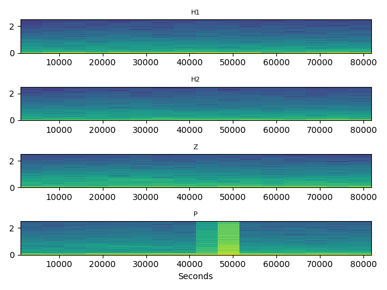

Figure 2: Daily spectrogram for the vertical (Z), horizontals (H1, H2), and pressure
(P) components.

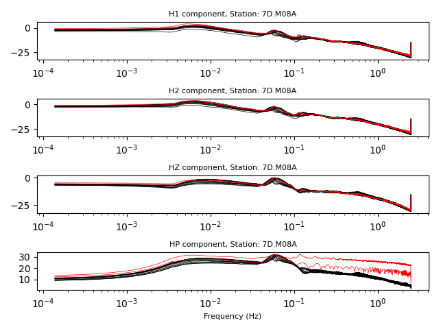

Figure 3a: Power spectral density (PSD) functions for the Z, H1, H2, and P compo-
nents from a single day of data (M08A, March 4, 2012, same as in Figure 2). The left
column shows PSDs for each individual window; PSDs from windows that did not
pass the quality control are colored red.

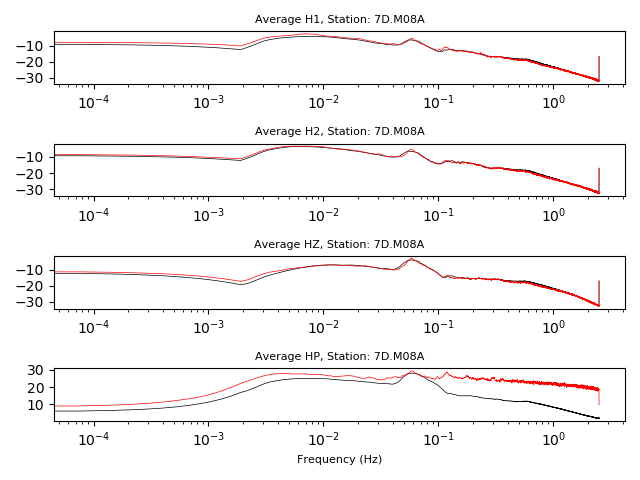

Figure 3a: Daily average PSD of bad (red) and good (black) windows.

3. QC for clean station averages
++++++++++++++++++++++++++++++++

Now that we have processed daily spectra for all available components, it is
possible to further average the spectra over multiple days to produce a cleaned
station average. It is still possible to specify a date range over which to 
average the spectra, thus giving flexibility in the production of the station
averages. Parameter settings are similar to those used in ``atacr_daily_spectra.py``
but further include the option of plotting the averaged cross-spectral properties.
To calcualte a single station average for the entire month of March 2012 (and 
therefore using all available data) and plot the results, we can type in a terminal:

.. code-block::

    $ atacr_clean_spectra.py --figQC --figAverage --figCoh --figCross M08A.pkl

    Path to AVG_STA/7D.M08A/ doesn`t exist - creating it

    |===============================================|
    |===============================================|
    |                       M08A                    |
    |===============================================|
    |===============================================|
    |  Station: 7D.M08A                             |
    |      Channel: BH; Locations: --               |
    |      Lon: -124.90; Lat:  44.12                |
    |      Start time: 2011-10-20 00:00:00          |
    |      End time:   2012-07-18 23:59:59          |
    |-----------------------------------------------|

    **********************************************************************
    * Calculating noise spectra for key 7D.M08A and day 2012.061
    *   -> file SPECTRA/7D.M08A/2012.061.spectra.pkl found - loading

    **********************************************************************
    * Calculating noise spectra for key 7D.M08A and day 2012.062
    *   -> file SPECTRA/7D.M08A/2012.062.spectra.pkl found - loading

    ...

And so on until all ``DayNoise`` objects are averaged into a ``StaNoise`` 
object, which is saved to a newly created folder called ``AVG_STA/7D.M08A/``.
Several figures are also produced, including Figures 4, 6-9.

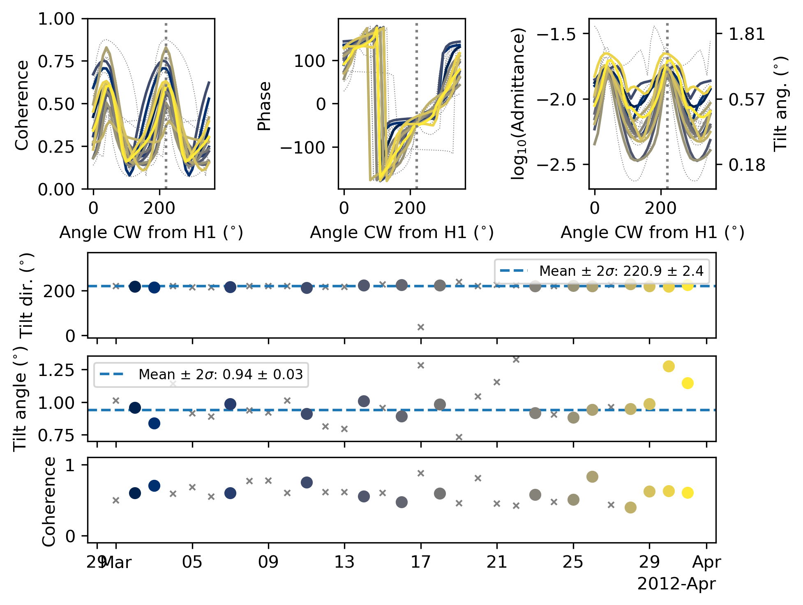

Figure 4: The orientation of maximum coherence between the vertical and the two
horizontal components for M08A during March 2012. (Left) Coherence as a function
of angle from the H1 component. (Right) Phase as a function of the angle. In this
example, the coherence is low indicating the absence of dominant, uni-directional tilt
noise.

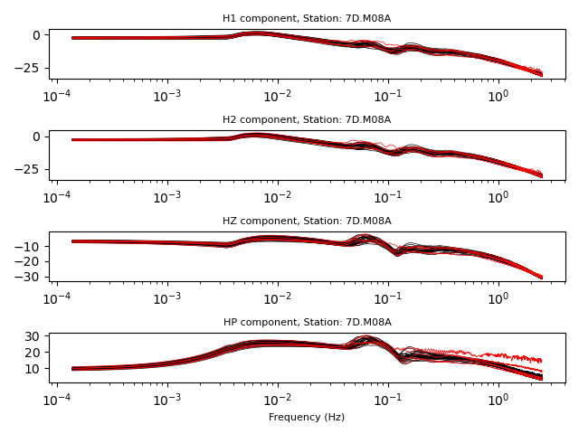

Figure 6: The daily PSDs plotted for the vertical (Z), horizontal (H1, H2), and
pressure (P) components for March 2012 at station M08A. Each line is a daily PSD.
Gray colors indicate days that were accepted by the second quality control step,
while the red colors indicate days that were discarded.

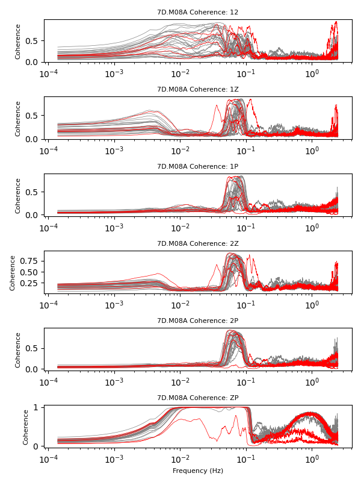

Figure 7: The daily coherences between pairs of components as indicated above each
subplot for March 2012 at station M08A (e.g. 1Z - coherence between Horizontal 1
and Vertical). Each line represents average coherence for a single day in the data
set. Gray colors indicate days that were accepted by the second quality control step,
while the red colors indicate days that were discarded. Note that some definitions
are different (e.g., ``ZP`` vs ``PZ``) than those used in the Matlab Tutorial.

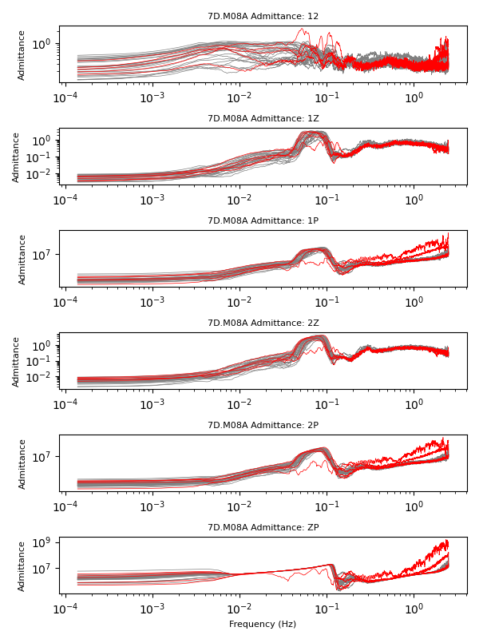

Figure 8: The daily admittances between pairs of components as indicated above
(see Figure 7) each subplot for March 2012 at station M08A. Each line is a daily
admittance. Gray colors indicate days that were accepted by the second quality
control step, while the red colors indicate days that were discarded.
Note that some definitions are different (e.g., ``ZP`` vs ``PZ``) than those used 
in the Matlab Tutorial.

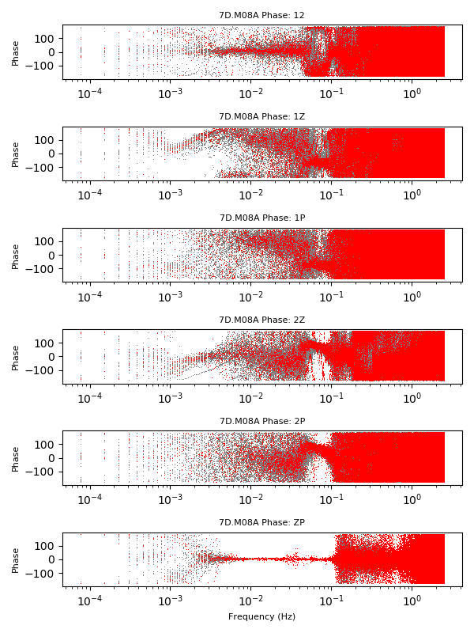

Figure 9: The daily phases between pairs of components as indicated above (see
Figure 7) each subplot for March 2012 at station M08A. Each line is a daily phase.
Gray colors indicate days that were accepted by the second quality control step,
while the red colors indicate days that were discarded. Note that some definitions
are different (e.g., ``ZP`` vs ``PZ``) than those used in the Matlab Tutorial.

4. Transfer function calculation
++++++++++++++++++++++++++++++++

Once the ``StaNoise`` objects have been produced and saved to disk, the transfer 
functions across all available components can be calculated. By default the software
will calculate the ones for which the spectral averages are available. 

For compliance only (i.e., only ``?HZ`` and ``?XH?`` components are available),
the only transfer function possible is:

- ``ZP``

For tilt only (i.e., all of ``?HZ,1,2`` components are available, but not ``?XH``), 
the transfer functions are:

- ``Z1``

- ``Z2-1``

For both tilt and compliance (i.e., all four components are available), the 
following transfer functions are possible:

- ``Z1``

- ``Z2-1``

- ``ZP``

- ``ZP-21``

If you are using a ``DayNoise`` object to calculate the transfer functions,
the following may also be possible (if all components are available):

- ``ZH``

- ``ZP-H``

In this example we calculate all available transfer functions for all available data.
In this case we do not need to specify any option and type in a terminal:

.. code-block::

    $ atacr_transfer_functions.py M08A.pkl

    Path to TF_STA/7D.M08A/ doesn't exist - creating it
     
    |===============================================|
    |===============================================|
    |                       M08A                    |
    |===============================================|
    |===============================================|
    |  Station: 7D.M08A                             |
    |      Channel: BH; Locations: --               |
    |      Lon: -124.90; Lat:  44.12                |
    |      Start time: 2011-10-20 00:00:00          |
    |      End time:   2012-07-18 23:59:59          |
    |-----------------------------------------------|

    **********************************************************************
    * Calculating transfer functions for key 7D.M08A and day 2012.088

    **********************************************************************
    * Calculating transfer functions for key 7D.M08A and day 2012.075

    ...

    **********************************************************************
    * Calculating transfer functions for key 7D.M08A and range 2011.293-2012.200.

Note how the ``DayNoise`` objects are read randomly from disk, followed by the 
``StaNoise`` object. The result is a ``TFNoise`` object that is saved to a newly
created folder called ``TF_STA/7D.M08A/``. 

We can produce Figure 10 by re-running the previous command with the options
``-O --figTF``. 

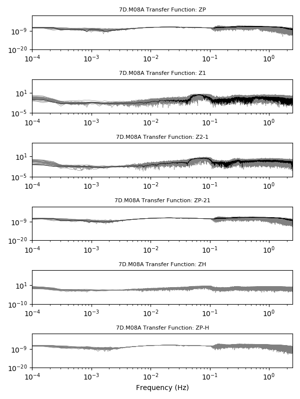

Figure 10: Transfer function amplitudes for the component combinations of interest,
as indicated in the title of each subplot. This example is for the month of March 2012
for station M08A. The daily transfer functions are shown in grey and the average
calculated for the whole month is shown in black.

5. Download earthquake data
+++++++++++++++++++++++++++

Now we need to download the earthquake data, for which we wish to 
clean the vertical component using the transfer functions just calculated. 
This script ``atacr_download_event.py`` is very similar to ``atacr_download_data.py``, 
with the addition of the Event and Geometry Settings. 

.. warning::

    Be careful with the Frequency Settings, as these values need to be exactly
    the same as those used in ``atacr_download_data.py``, but won't be checked
    against. 

To download the seismograms that recorded the March 9, 2012, magnitude 6.6 
Vanuatu earthquake (be conservative with the options), type in a terminal:

.. code-block::

    $ atacr_download_event.py --min-mag=6.3 --max-mag=6.7 --start=2012-03-08 --end=2012-03-10 M08A.pkl

    Path to EVENTS/7D.M08A/ doesn`t exist - creating it
     
    |===============================================|
    |===============================================|
    |                       M08A                    |
    |===============================================|
    |===============================================|
    |  Station: 7D.M08A                             |
    |      Channel: BH; Locations: --               |
    |      Lon: -124.90; Lat:  44.12                |
    |      Start time: 2011-10-20 00:00:00          |
    |      End time:   2012-07-18 23:59:59          |
    |-----------------------------------------------|
    | Searching Possible events:                    |
    |   Start: 2012-03-08 00:00:00                  |
    |   End:   2012-03-10 00:00:00                  |
    |   Mag:   6.3 - 6.7                            |
    | ...                                           |
    |  Found     1 possible events                  |
     
    ****************************************************
    * #1 (2/1):  20120309_070953
    *   Origin Time: 2012-03-09 07:09:53
    *   Lat: -19.22; Lon:  169.75
    *   Dep:  33.70; Mag: 6.6
    *     M08A  -> Ev: 9651.91 km;   86.80 deg; 239.43;  40.95

    * Channels selected: ['H', 'P'] and vertical
    *   2012.069.07.09                                     
    *   -> Downloading Seismic data... 
    *      ...done
    *   -> Downloading Pressure data...
         ...done
    *   -> Removing responses - Seismic data
     WARNING: FIR normalized: sum[coef]=9.767192E-01;     
     WARNING: FIR normalized: sum[coef]=9.767192E-01;     
     WARNING: FIR normalized: sum[coef]=9.767192E-01;     
    *   -> Removing responses - Pressure data
     WARNING: FIR normalized: sum[coef]=9.767192E-01;  
 
The data are stored as an ``EventStream`` object, saved to disk in the
newly created folder ``EVENTS/7D.M08A/``. 

6. Correct/clean earthquake data
++++++++++++++++++++++++++++++++

The final step in the analysis is the application of the transfer functions
to the raw earthquake seismograms to clean up the vertical component. 
Once again, the default settings can be used. To make the final Figures 11 and 12,
specify the ``--fig_Raw`` and ``--figClean`` options:

.. code-block::

    $ atacr_correct_event.py --figRaw --figClean M08A.pkl

 
    |===============================================|
    |===============================================|
    |                       M08A                    |
    |===============================================|
    |===============================================|
    |  Station: 7D.M08A                             |
    |      Channel: BH; Locations: --               |
    |      Lon: -124.90; Lat:  44.12                |
    |      Start time: 2011-10-20 00:00:00          |
    |      End time:   2012-07-18 23:59:59          |
    |-----------------------------------------------|
    TF_STA/7D.M08A/2011.293-2012.200.transfunc.pkl file found - applying transfer functions
    TF_STA/7D.M08A/2012.069.transfunc.pkl file found - applying transfer functions

Results are saved as ``EventStream`` objects that now contain the corrected
vertical components.

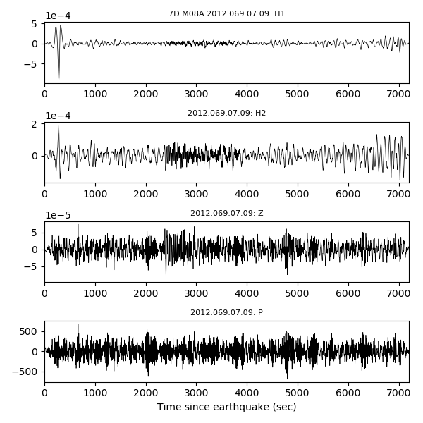

Figure 11: Event time series for the vertical (Z), horizontal 1 (H1), horizontal 2 (H2),
and pressure (P) components. No corrections have been applied. The data is for
station M08A for the Mw 6.6 earthquake that occurred near Vanuatu on March 9,
2012 and has been bandpass filtered from 10 - 150 s.

.. figure:: ../obstools/examples/figures/Figure_12a.png
   :align: center

Figure 12a: Event time series for the vertical (Z) components after each of the transfer
functions of interest have been applied. The corrections are specified in the titles of
each subplot. The data is for station M08A for the Mw 6.6 earthquake that occurred
near Vanuatu on March 9, 2012 (same as Figure 11) and has been bandpass filtered
from 10 - 150 s. Traces in grey show the original (raw, un-corrected) vertical component.

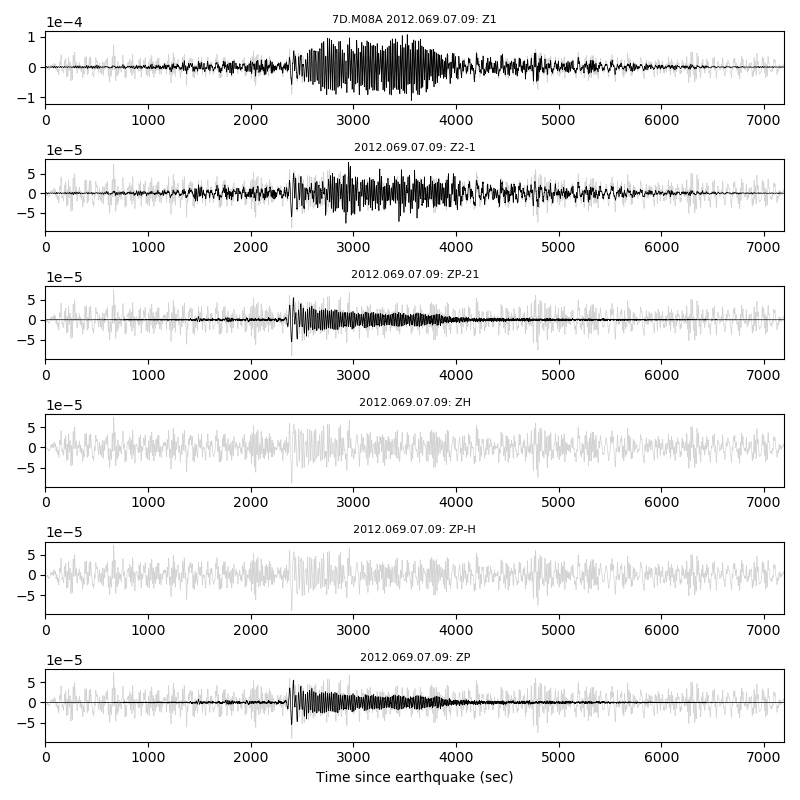

Figure 12b: Same as Figure 12a but using the station averaged transfer functions. In this 
case the ``ZH`` and ``ZP-H`` transfer functions are not available.

